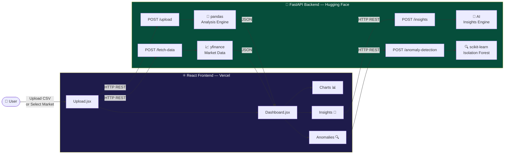

<div align="center">

<!-- Animated Banner -->


<!-- Typing Animation -->
<a href="https://git.io/typing-svg">
  
</a>

<br/>

<!-- Badges Row 1 -->
[](https://python.org)
[](https://fastapi.tiangolo.com)
[](https://react.dev)
[](https://scikit-learn.org)

<!-- Badges Row 2 -->
[](https://ai-csv-analyzer-beta.vercel.app)
[](https://akankshakesarkar-ai-csv-analyzer-backend.hf.space)
[](https://docker.com)
[](LICENSE)

<!-- Stats -->
[](https://github.com/AkankshaKesarkar/ai-csv-analyzer/stargazers)
[](https://github.com/AkankshaKesarkar/ai-csv-analyzer/network)
[](https://github.com/AkankshaKesarkar/ai-csv-analyzer/commits)

<br/>

<!-- Live Demo Button -->
<a href="https://ai-csv-analyzer-beta.vercel.app">
  
</a>
&nbsp;
<a href="https://akankshakesarkar-ai-csv-analyzer-backend.hf.space/docs">
  
</a>

</div>

---

## 🎯 What Makes This Special?

> **Not just another CSV viewer.** This is a production-grade, end-to-end AI analytics platform that ingests raw data and transforms it into actionable intelligence — in seconds.

<table>
<tr>
<td width="50%">

### 🧠 Intelligence Layer
- 🤖 **AI-Powered Insights** — automated pattern detection
- 🔍 **Isolation Forest ML** — unsupervised anomaly detection
- 📊 **Statistical Engine** — skewness, kurtosis, IQR analysis
- 🌍 **Live Market Data** — real-time stocks, crypto, indices

</td>
<td width="50%">

### ⚡ Engineering Layer
- 🚀 **FastAPI Backend** — async Python REST API
- ⚛️ **React Frontend** — component-based SPA
- 🐳 **Dockerized** — containerized for portability
- ☁️ **Fully Deployed** — Vercel + Hugging Face Spaces

</td>
</tr>
</table>

---

## 🏗️ System Architecture



---

## ✨ Features Showcase

| | Feature | What It Does |
|---|---|---|
| 📤 | **CSV Upload** | Drag & drop any CSV — sales, finance, healthcare, IoT |
| 📈 | **Full Statistics** | Mean, median, std, IQR, skewness, kurtosis, outliers |
| 📊 | **Interactive Charts** | Distribution histograms + monthly trend lines |
| 🔗 | **Correlation Matrix** | Color-coded heatmap of column relationships |
| 🤖 | **AI Insights** | Pattern detection, risk flags, recommendations |
| 🌍 | **Real-World Data** | Live: AAPL, NVDA, Nifty 50, BTC, ETH, Sensex |
| 🔍 | **Anomaly Detection** | Isolation Forest flags outlier rows automatically |
| 📋 | **Data Preview** | First 10 rows with full column type detection |

---

## 🛠️ Tech Stack

<div align="center">

### Frontend


### Backend


### Deployment & DevOps


</div>

---

## 📁 Project Structure

```
ai-csv-analyzer/
│
├── 📂 backend/                     # Python FastAPI Backend
│   ├── 🐍 main.py                  # 7 REST API endpoints
│   ├── 🔬 analyzer.py              # pandas + scikit-learn engine
│   ├── 📈 data_fetcher.py          # yfinance market data fetcher
│   ├── 🐳 Dockerfile               # Docker config → Hugging Face
│   └── 📋 requirements.txt
│
├── 📂 frontend/                    # React + Vite Frontend
│   └── 📂 src/
│       ├── 📂 components/
│       │   ├── ⬆️  Upload.jsx      # CSV drag & drop upload
│       │   ├── 📊 Dashboard.jsx    # Full analytics dashboard
│       │   └── 🌍 RealData.jsx     # Live market data page
│       ├── App.jsx
│       └── main.jsx
│
├── 📂 sample_data/                 # 11 real-world CSV datasets
│   ├── 🍎 apple_stock_1y.csv
│   ├── 🟢 nvidia_stock_1y.csv
│   ├── 🇮🇳 nifty50_1y.csv
│   ├── ₿  bitcoin_1y.csv
│   └── ... 7 more
│
└── 📄 README.md
```

---

## 🚀 Quick Start

### Option A — Use Live Demo (No Setup!)
👉 **[https://ai-csv-analyzer-beta.vercel.app](https://ai-csv-analyzer-beta.vercel.app)**

### Option B — Run Locally

```bash
# 1. Clone
git clone https://github.com/AkankshaKesarkar/ai-csv-analyzer.git
cd ai-csv-analyzer

# 2. Backend
cd backend
pip install -r requirements.txt
uvicorn main:app --reload --port 8000
# → http://localhost:8000/docs

# 3. Frontend (new terminal)
cd frontend
npm install
npm run dev
# → http://localhost:5173
```

Create `frontend/.env`:
```env
VITE_API_URL=http://localhost:8000
```

---

## 🌍 API Reference

| Method | Endpoint | Description | Auth |
|---|---|---|---|
| `GET` | `/` | Health check | None |
| `GET` | `/health` | Detailed health | None |
| `POST` | `/upload` | CSV → full analysis | None |
| `POST` | `/fetch-data` | Live market data | None |
| `POST` | `/insights` | AI insights | None |
| `POST` | `/anomaly-detection` | Isolation Forest ML | None |
| `POST` | `/correlation` | Correlation matrix | None |

> 📖 Full interactive docs: [https://akankshakesarkar-ai-csv-analyzer-backend.hf.space/docs](https://akankshakesarkar-ai-csv-analyzer-backend.hf.space/docs)

---

## 📊 Sample Datasets

<div align="center">

| Dataset | Symbol | Market | Period |
|---|---|---|---|
| 🍎 Apple Inc. | `AAPL` | 🇺🇸 US | 1 Year |
| 🟢 NVIDIA | `NVDA` | 🇺🇸 US | 1 Year |
| 🪟 Microsoft | `MSFT` | 🇺🇸 US | 1 Year |
| ⚡ Tesla | `TSLA` | 🇺🇸 US | 1 Year |
| 🇮🇳 Nifty 50 | `^NSEI` | 🇮🇳 India | 1 Year |
| 💻 TCS | `TCS.NS` | 🇮🇳 India | 1 Year |
| 🏭 Reliance | `RELIANCE.NS` | 🇮🇳 India | 1 Year |
| 🔷 Infosys | `INFY.NS` | 🇮🇳 India | 1 Year |
| ₿ Bitcoin | `BTC-USD` | Crypto | 1 Year |
| ⧫ Ethereum | `ETH-USD` | Crypto | 1 Year |
| ☀️ Solana | `SOL-USD` | Crypto | 1 Year |

</div>

---

## 💡 Skills Demonstrated

<div align="center">

| Domain | Skills |
|---|---|
| 🔧 **Backend** | FastAPI, REST API design, Pydantic validation, CORS |
| 🐼 **Data Engineering** | pandas, NumPy, data cleaning, transformation |
| 🤖 **Machine Learning** | Isolation Forest, StandardScaler, unsupervised ML |
| 📊 **Statistics** | Skewness, kurtosis, IQR, outlier detection, correlation |
| 💰 **Finance** | OHLCV data, moving averages, volatility, returns |
| ⚛️ **Frontend** | React, Vite, Recharts, Axios, component architecture |
| ☁️ **DevOps** | Docker, Vercel deployment, Hugging Face Spaces, CI/CD |
| 🌐 **Full Stack** | End-to-end feature development, API integration |

</div>

---

## 🔮 Roadmap

- [ ] 🗄️ PostgreSQL — store analysis history
- [ ] 🔐 JWT Authentication — user accounts
- [ ] 📄 PDF Export — download analysis reports
- [ ] 📧 Email Alerts — anomaly notifications
- [ ] 📑 Excel/JSON Support — more file formats
- [ ] 💬 Natural Language Queries — "show me top outliers"
- [ ] 📱 Mobile Responsive — full mobile support

---

## 🤝 Contributing

```bash
# Fork → Clone → Branch → Code → PR
git checkout -b feature/YourAmazingFeature
git commit -m "✨ Add YourAmazingFeature"
git push origin feature/YourAmazingFeature
# Open Pull Request 🚀
```

---

## 📄 License

Distributed under the **MIT License** — use freely, credit kindly.

---

## 👩‍💻 Author

<div align="center">

**Akanksha Kesarkar**

[](https://github.com/AkankshaKesarkar)

</div>

---

<div align="center">

<!-- Footer Wave -->


**⭐ Star this repo if it helped you! ⭐**

Built with ❤️ using Python · FastAPI · React · scikit-learn · yfinance · Docker

🚀 **[Live Demo](https://ai-csv-analyzer-beta.vercel.app)** · ⚙️ **[API Docs](https://akankshakesarkar-ai-csv-analyzer-backend.hf.space/docs)** · 🐛 **[Report Bug](https://github.com/AkankshaKesarkar/ai-csv-analyzer/issues)**

</div>
